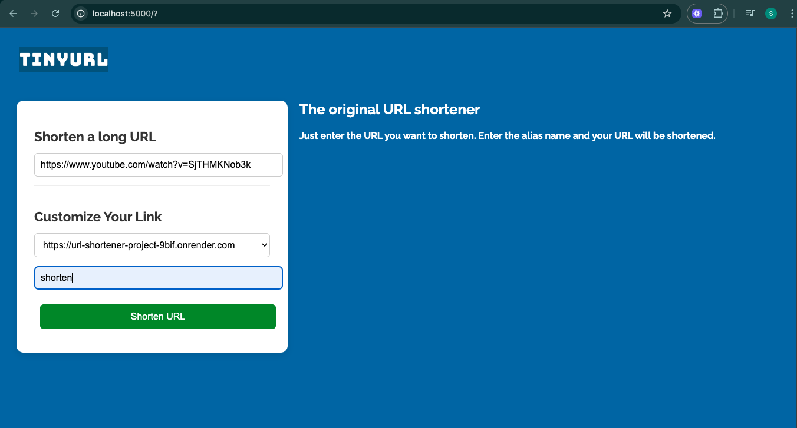
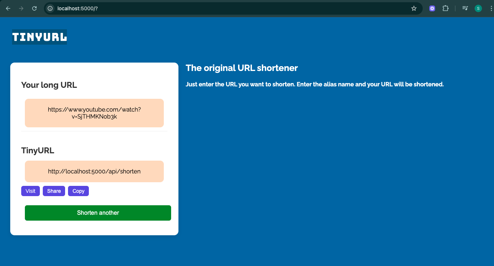

# 🔗 TinyURL - URL Shortener (Node.js + MongoDB)

A simple, user-friendly URL shortener web app inspired by TinyURL. Built using **Node.js**, **Express.js**, **MongoDB**, and custom frontend. Users can shorten long URLs and create custom aliases with ease.


## 🖼️ Preview

### 🎯 Home Page (Shorten Form)


### 📦 Result Page (Generated Link)



## ✨ Features

- 🔗 Shorten any long URL to a small one
- 🏷️ Option to customize the short URL alias
- 🌐 Live frontend connected to backend API
- ⏎ Redirects instantly to original URL
- 📦 MongoDB stores all shortened URL mappings
- ⚠️ Validation for malformed/invalid URLs
- 🧪 RESTful API support
- 📋 Buttons to copy, visit, and share the short URL


## 🛠 Tech Stack

- Frontend : HTML, CSS, JavaScript (Vanilla)
- Backend : Node.js, Express.js
- Database : MongoDB using Mongoose
- Utilities : dotenv, nanoid, validator


```text url-shortener/ ├── config/ # MongoDB connection setup │ └── db.js ├── controller/ # URL shortening logic (optional abstraction) │ └── urlController.js ├── model/ # Mongoose schema │ └── url.js ├── public/ # Static frontend files (HTML, CSS, JS) │ ├── index.html │ ├── style.css │ └── script.js ├── router/ # Express route handlers │ └── urlRoute.js ├── .env # Environment variables ├── package.json # Project metadata and dependencies ├── package-lock.json ├── sample.txt # Sample input or test file (if needed) └── server.js # App entry point ```


## ⚙️ Setup Instructions

### 1. Clone the Repository

git clone https://github.com/shubham-gupta-iphtech/URL-shortener-project.git
cd url-shortener

npm install

PORT=5000
MONGO_URI=your_mongodb_connection_string
BASE_URL=http://localhost:5000

npm start

Access the app at: http://localhost:5000/

📬 API Endpoints

🔗 POST /shorten
Generates a short URL with a random code.

✅ Request Body:
{
  "urlReceived": "https://example.com"
}

🔁 Response:
{
  "message": "http://localhost:5000/abc1234"
}

⚠️ Errors:
{
  "message": "This url is already shortened."
}

🔗 POST /shortenbyalias
Creates a short URL with a custom alias provided by the user.

✅ Request Body:
{
  "urlReceived": "https://example.com",
  "alias": "custom123"
}

🔁 Response:
{
  "message": "http://localhost:5000/custom123"
}

⚠️ Errors:
{
  "message": "this alias has been aleady used."
}

{
  "message": "This url is already shortened."
}

🔗 GET /:code
Redirects a short code to the original long URL.

🌐 Example:
GET /abc1234 → Redirects to https://example.com

⚠️ Error:
{
  "message": "url not found"
}

Built with 💙 by Shubham Gupta
